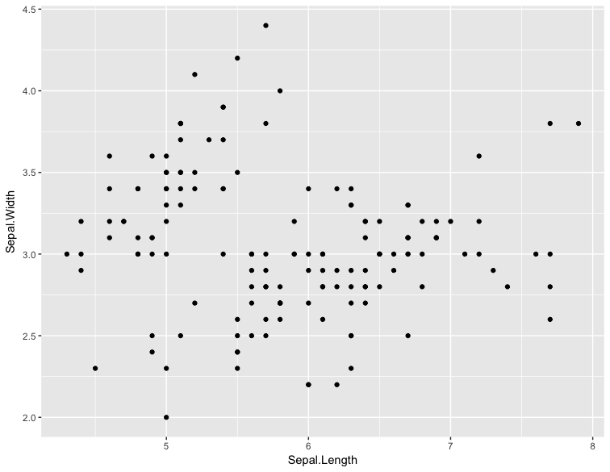
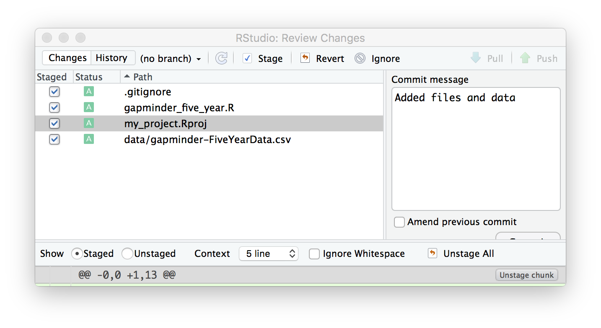

**Advanced R**
--------------

Before we begin...

Let's get started by making sure our working directory is correct.

.. code-block :: R

	getwd() # Are you in your Home directory? If so nothing needs to be done

6. Loops 
========

6.1 For loops
~~~~~~~~~~~~~~

Sometimes you'll want to apply the same function call to a collection of objects. For instance, say you want the avg.life expectance for each continent. To do that normally, we would do something like the following:

.. code-block :: R

	unique(gapminder$continent)

	cont <- "Asia"
	res <- gapminder %>% filter(continent == cont) %>% summarise(avg = mean(lifeExp))
	print(paste0("The avg life expentency of ", cont, " is: ", res))

	cont <- "Europe"
	res <- gapminder %>% filter(continent == cont) %>% summarise(avg = mean(lifeExp))
	paste0("The avg life expentency of ", cont, " is: ", res)

And we would have to run these three lines of code for each continent.

We can have R do this automatically for us for a collection of objects.  Here, the collection of objects is the list of continents.

We can loop through these one at a time and do the same thing as before, using the following syntax:

.. code-block :: R

	for (placeholder in collectionOfObjects)
	{
     	DoSomeTask
	}

Below, ``cont`` is your placeholder. We could put anything in this placeholder that we want. It's just something that we can refer to in the body of the for loop. We are taking each element in ``unique(gapminder$continent)`` and assigning it to this placeholder, ``cont``.

.. code-block :: R

	for (cont in unique(gapminder$continent)) {
	  res <- gapminder %>% filter(continent == cont) %>% summarise(avg = mean(lifeExp))
	  print(paste0("The avg life expentency of ", cont, " is: ", res))
	}
	[1] "The avg life expentency of Asia is: 60.0649032323232"
	[1] "The avg life expentency of Europe is: 71.9036861111111"
	[1] "The avg life expentency of Africa is: 48.8653301282051"
	[1] "The avg life expentency of Americas is: 64.6587366666667"
	[1] "The avg life expentency of Oceania is: 74.3262083333333"

Here we are taking each element in ``unique(gapminder$continent)`` and sequentially assigning it to the variable cont (which is completely arbitrary; it could easibly be continent, cont, x, y, z). The variable ``cont`` is then used in the code to perform a function.

Let's use a different variable and see if we get the same results.

.. code-block :: R

	for (blash in unique(gapminder$continent)) {
	  res <- gapminder %>% filter(continent == blah) %>% summarise(avg = mean(lifeExp))
	  print(paste0("The avg life expentency of ", blah, " is: ", res))
	}
	[1] "The avg life expentency of Asia is: 60.0649032323232"
	[1] "The avg life expentency of Europe is: 71.9036861111111"
	[1] "The avg life expentency of Africa is: 48.8653301282051"
	[1] "The avg life expentency of Americas is: 64.6587366666667"
	[1] "The avg life expentency of Oceania is: 74.3262083333333"

6.2 Nesting for loops
^^^^^^^^^^^^^^^^^^^^^

You can nest ``for`` loops as well!  Here for each value of ``cont`` (a.k.a each value of ``unique(gapminder$continent)``), we will also loop through each value of ``yr`` (a.k.a ``unique(gapminder$year)``). But for now we will use 2 years instead of all years..

.. code-block :: R

	unique(gapminder$year)

	yr <- c("1952", "1957")

	for (cont in unique(gapminder$continent)) {
	  for (y in yr) {
	    res <- gapminder %>% filter(continent == cont, year == y) %>% summarise(avg = mean(lifeExp))
	    print(paste0("The avg life expentency of ", cont,  "in the year ", y, " is: ", res))
	  }
	}
	[1] "The avg life expentency of Asiain the year 1952 is: 46.3143939393939"
	[1] "The avg life expentency of Asiain the year 1957 is: 49.3185442424242"
	[1] "The avg life expentency of Europein the year 1952 is: 64.4085"
	[1] "The avg life expentency of Europein the year 1957 is: 66.7030666666667"
	[1] "The avg life expentency of Africain the year 1952 is: 39.1355"
	[1] "The avg life expentency of Africain the year 1957 is: 41.2663461538462"
	[1] "The avg life expentency of Americasin the year 1952 is: 53.27984"
	[1] "The avg life expentency of Americasin the year 1957 is: 55.96028"
	[1] "The avg life expentency of Oceaniain the year 1952 is: 69.255"
	[1] "The avg life expentency of Oceaniain the year 1957 is: 70.295"

**Limitations of for loops**

For loops are very usefule for certain data types, but at times can become very slow. Below are some rules for using for loops as opposed to apply functions (which we are going to talk about next).

1. Don't use a loop when a vectorized alternative already exists (e.g. creating a loop to sum two vectors versus just using the ``+`` function which is created to add vectors)
2. Don't grow objects (via ``c``, ``cbind``, etc) during the loop
3. Allocate an object to hold the results and fill it in during the loop

**Challenge - 1

Write a nested loop to print the minimum and maximum life expentancy of "Canada", "United states" and "United Kingdom" for the year 2007

7. Conditionals
===============

7.1 If else 
~~~~~~~~~~~

7.1.1 If statment
^^^^^^^^^^^^^^^^^

When coding sometimes you want a particular function to be applied if a condition is true and sometimes a different function if it is not. To do this you need to use an if or if...else statement

In a simple ``if`` statement, a function is executed if the test expression is true while it is ignored entirely if it is false.

.. code-block :: R

	x <- 5
	if (x > 0) {
	     print('Positive number')
	}
	# [1] "Positive number"

Here, ``x > 0`` is ``TRUE``, so the if statement is executed, and the statement is printed.

7.1.2 If..else statement
^^^^^^^^^^^^^^^^^^^^^^^^

The basic syntax is 

.. code-block :: R

	if (test_expression) {
	 statement1
	 } else {
	      statement2
	 }

Here the else statement is only used if the first test expression is false, if the first test expression is true then statement1 will be run.

.. code-block :: R

	x <- -5
	if(x > 0) {
	     print('Positive number')
	} else {
	     print('Negative number')
	}
	# [1] "Negative number"

Here, ``x > 0`` is ``FALSE``, so the ``if`` statement is not executed and instead the ``else`` statement is executed.

You can nest as many if...else statements as you want.

.. code-block :: R

	x <- 0
	if(x > 0) {
	     print('Positive number')
	} else if (x < 0) {
	     print('Negative number')
	} else {
	     print('Zero')
	}
	# [1] "Zero"

- **Exercises**

1. What would be the output of the following code:

.. code-block :: R

	x <- -6
	if(x > 0){
	     print('x is greater than zero')
	}

A. x is greater than zero
B. x is less than zero
C. nothing
D. an error message

2. How could you change the code so that if ``x`` is less than 0 you get a message saying ``x is less than zero``? 

8. Functions
============

A functions is a piece of code written to carry out a specified task; they allow you to incorporate sets of instructions that you want to use mutliple times or, if you have a complex set of instructions, keep it together within a small program.

For example, the base R function ``mean()`` gives you a simple way to get an average; when you read your script you can immediately tell what the code will do.

But we can also build our own functions to do things over and over again. Generally, if you have to do a task more than 3 times, it's generally better to go ahead and create a custom function.

The general syntax of a function is:

.. code-block :: R

	NameOfFunction <- function(Arguments)
	{
	     body
	}

Let's build our own function. We are going to make a function that will calculate the mean as the base R mean() function does above:

.. code-block :: R

	my_mean <- function(data,col)
	{
	     avg <- sum(data[col])/nrow(data)
	     return(avg)
	}

	my_mean(gapminder,'lifeExp')
	my_mean(gapminder, 'gdpPercap')

Let's build a new function that will convert a temperature in fahrenheit to kelvin:

.. code-block :: R

	fahr_to_kelvin <- function(temp)
	{
	     kelvin <- ((temp -32) * (5/9) + 273.15)
	     return(kelvin)
	}

Functions can only return 1 thing. This means that the last thing you return in a function is what is output. In order to have the output returned, we have to use return. This sends results outside of the function otherwise we see no output.

.. Note :: 

	When you run the code above, you won't see any output. That's because we've only saved the function. Just like `mean()`, if you run it without any arguments, you'll get an error.

.. code-block :: R

	mean()
	# Error in mean.default() : argument "x" is missing, with no default

The function we created has one argument (``temp``) and we assigned that function a name ``fahr_to_kelvin``. This name is what we can use to call the function, just like we would call ``mean()``. The body of the function, between the `{}`, is what the function actually does.

When we call this function, the value we input is assigned to the object `temp` and is fed through the code within the body.

.. code-block :: R

	fahr_to_kelvin(32)
	# [1] 273.15

	fahr_to_kelvin(212)
	# [1] 373.15

- **Challenge-2**

1. Create a function called ``Avg`` that calculates the average of 2 numbers. Don't forget to check your work.

9. Plotting
===========

9.1 Basic plotting
~~~~~~~~~~~~~~~~~~~

Plotting is essential and can be done in base R

Something that every researcher knows is important is communicating your findings, and we often do that with plots. We can create fine tuned plots in R using Base R, without using additional packages. 

Let's read in a dataset, called ``iris`` and take a look at it.

.. code-block :: R

	download.file("https://raw.githubusercontent.com/upendrak/intro-r-20170825/master/datasets/iris.txt", "iris.txt")

.. code-block :: R

	iris <- read.csv("iris.txt", sep="\t")
	str(iris)
	# Classes ‘tbl_df’, ‘tbl’ and 'data.frame':	150 obs. of  5 variables:
	#  $ Sepal.Length: num  5.1 4.9 4.7 4.6 5 5.4 4.6 5 4.4 4.9 ...
	#  $ Sepal.Width : num  3.5 3 3.2 3.1 3.6 3.9 3.4 3.4 2.9 3.1 ...
	#  $ Petal.Length: num  1.4 1.4 1.3 1.5 1.4 1.7 1.4 1.5 1.4 1.5 ...
	#  $ Petal.Width : num  0.2 0.2 0.2 0.2 0.2 0.4 0.3 0.2 0.2 0.1 ...
	#  $ Species     : chr  "setosa" "setosa" "setosa" "setosa" ...

This dataset has information on plants of 3 types of irises. They've measured the length and width of the petals of the flower and the sepals (green parts that often surround the flower).

Let’s make three main kinds of plot using base R—a scatterplot, a histogram, and a boxplot—then we’ll make these same plots using a R package specifically designed for making plots and figures called ggplot.

9.1.1 Scatterplot
^^^^^^^^^^^^^^^^^

The basic plot function is ``plot(x, y, ….)`` which x corresponding to your x-variable and y to the y-variable.
Let’s plot sepal length as a function of petal length.

.. code-block :: R

	plot(iris$Sepal.Length, iris$Petal.Length)

|plot-1|

We see a scatterplot that shows there is a positive association between sepal and petal length. To add a linear regression line, you would need to use two commands ``abline()`` and ``lm()``. ``lm()`` is used to fit linear models and uses the arguments ``lm(y ~ x)``, while ``abline`` will actually fit a line to the most recent plot. Let’s try it out.

.. code-block :: R

	plot(iris$Sepal.Length, iris$Petal.Length)
	abline(lm(iris$Petal.Length ~ iris$Sepal.Length))

|plot-2|

9.1.2 Histogram
^^^^^^^^^^^^^^^

Plot will default to a scatterplot, but if you want a histogram then you need to use the type argument.

.. code-block :: R

	plot(iris$Sepal.Length, type = 'h')

|plot-3|

9.1.3 Boxplot
^^^^^^^^^^^^^

To make a boxplot, you can use the function ``boxplot(x ~ y, data = dataframe)``. Let’s plot sepal length as a function of species.

.. code-block :: R

	boxplot(Sepal.Length ~ Species, data = iris)

|plot-4|

If you ever want to change what order the categories on the x-axis are displayed in you would need to order the factor levels of that column.

Plotting in base R can be flexible and you can actually do a lot with it, but many people find ggplot more user friendly and easier to learn. Let’s move on and learn how to do these plots using the ggplot package. Whichever you decide to use, there is a lot of help online if you need it.

- **Exercises**

1. Pull up the ``plot`` help page. What arguments would you use to change the ``x`` and ``y`` axis label?

2. Change the axes labels for the first graph we did. See the code below..

.. code-block :: R

	plot(iris$Sepal.Length, iris$Petal.Length)

9.2 ggplot2
~~~~~~~~~~~

ggplot2 works on the idea that every plot has three essential elements:

+------------+----------------------------------------+
| Element    | Description                            |
+============+========================================+
| Data       | The dataset being plotted.             |
+------------+----------------------------------------+
| Aesthetics | The scales onto which we map our data. |
+------------+----------------------------------------+
| Geometries | The visual elements used for our data. | 
+------------+----------------------------------------+

In other words, we have the dataset, the space onto which we will plot our data (axes), and the visualization we will use to plot each datapoint (scatterplot, barplot, boxplot). These are the 3 elements we will discuss today.

**Syntax of ggplot**

The basic syntax of ggplot2 is to start the line with the function ``ggplot()``. In the parentheses, you want at minimum to name your dataset.

.. code-block :: R

	ggplot(iris)

|ggplot-9|

Notice that it opens the Plot window, but nothing is there. That's because we haven't yet told it what to do with our dataset.

Next we have to give it the aesthetics. That is, how do we want to represent our data.

We do this by adding an argument called ``aes()``. Note that the aesthetics have to be within these parentheses.

The most straightforward thing to add is the columns we want to plot on the axes.

.. code-block :: R

	ggplot(iris, aes(x=Sepal.Length, y=Sepal.Width))

|ggplot-10|

Notice it opens the Plot window, and there's even an axis, but no data has been plotted. This is because we haven't told it what kind of plot (geometry) we want.

ggplot has several plot types, or geometries, that each start with ``geom_``.  The ones you'll likely use the most are:

- ``geom_point`` - scatter plots
- ``geom_histogram`` - for histograms
- ``geom_boxplot`` - for boxplots
- ``geom_bar`` - for barplots

Let's try plotting the same thing but add the geom_point.

.. code-block :: R

	ggplot(iris, aes(x=Sepal.Length, y=Sepal.Width)) + geom_point()

|ggplot-11|

.. Note :: 

	An important point is that each "layer" of complexity is drawn "in order", meaning that it renders the plot in the order that you type it. This means that the last "layer" will lay on top of the one before it.

- **Exercise**

Add another layer ``geom_smooth``, which allows us to add a trend line or spline to the scatter plot. 

9.2.1 Histogram
^^^^^^^^^^^^^^^

Let's instead try a histogram for Sepal Length

.. code-block :: R

	ggplot(iris, aes(x=Sepal.Length)) + geom_histogram()

|ggplot-12|

This one works, and you should see the histogram, which shows how many datapoints lie in each bin.

.. Note :: 

	You also get a warning, stating that the binwidth wasn't defined, so a default was used.

**Extra options**

There are some extra options for each plot that you can use to make your data stand out more.

Let's start with the histogram we just made and check out a few of the features we can tweak.

If we add a grouping feature, we can change the fill color of the bars based on species.  We do this using the ``fill`` argument.

.. code-block :: R

	ggplot(iris, aes(x=Sepal.Length, fill=Species)) + geom_histogram()

|ggplot-13|

These histograms are stacked on each other, but what if instead we want them independent of each other. We can use the ``position`` argument in the ``geom_histogram`` call to fix this. If we change it to ``identity``, it gives each species it's own histogram overlaid on each other.  It's difficult to see, so I've also added the ``alpha`` argument, which changes how see through each layer is.

.. code-block :: R

	ggplot(iris, aes(x=Sepal.Length, fill=Species)) + geom_histogram(position="identity", alpha=0.5)

|ggplot-14|

9.2.2 Scatterplots
^^^^^^^^^^^^^^^^^^

We can also change the appeal and readability of plots. Let's take a look at scatterplots and how we can change things to help explore our data. First, let's try changing the color. If we give it a continuous variable, it creates a gradient.

.. code-block :: R

	ggplot(iris, aes(x=Sepal.Length, y=Sepal.Width, color=Sepal.Width)) + geom_point()

|ggplot-16|

If instead we give it a categorical variable, such as `Species`, it assigns colors.

.. code-block :: R

	ggplot(iris, aes(x=Sepal.Length, y=Sepal.Width, color=Species)) + geom_point()

|ggplot-17|

We can also just assign a color that we like.

.. code-block :: R

	ggplot(iris, aes(x=Sepal.Length, y=Sepal.Width, color="coral")) + geom_point()

|ggplot-18|

.. Tip :: 

	The color option is inside the aesthetics `aes()` function!

For scatterplots, we can also assign shapes. Shapes only make sense if used with categorical data.

.. code-block :: R

	ggplot(iris, aes(x=Sepal.Length, y=Sepal.Width, shape=Species)) + geom_point()

|ggplot-19|

You can customize all of the colors and shapes instead of leaving it default. In the resources section, you can find information on these more advanced topics.

9.2.3 Boxplot
^^^^^^^^^^^^^

For a basic boxplot, you can use ``geom_boxplot()``

.. code-block :: R

	ggplot(iris, aes(x=Species, y=Sepal.Length)) + geom_boxplot()

|ggplot-24|

Similarly, we can also change the color of a boxplot.

.. code-block :: R

	ggplot(iris, aes(x=Species, y=Sepal.Length, color=Species)) + geom_boxplot()

|ggplot-25|

It outlined the boxes buut say we want to fill in the boxes instead. For this, we need to use the ``fill`` option.

.. code-block :: R

	ggplot(iris, aes(x=Species, y=Sepal.Length, fill=Species)) + geom_boxplot()

|ggplot-26|

9.2.4 Barplot
^^^^^^^^^^^^^

There are a few additional features on barplots.  We'll start with a basic barplot.

.. code-block :: R

	ggplot(iris, aes(Petal.Width)) + geom_bar()

|ggplot-27|

We get a bar for each plot. Note that this probably isn't the best way to visualize this data, but I just want to give you an example of ways to customize a bar plot.

Bar plots have some additional functionality. For example, we can add an aesthetic to consider Species. This creates a stacked barplot.

.. code-block :: R

	ggplot(iris, aes(Sepal.Length, fill=Species)) + geom_bar()

|ggplot-28|

Just like with the histogram, we can change how these bars lay around each other with the ``position`` argument, which we have to add to the ``geom_bar()`` statement

.. code-block :: R

	ggplot(iris, aes(Sepal.Length, fill=Species)) + geom_bar(position = "dodge")

|ggplot-29|

.. code-block :: R

	ggplot(iris, aes(Sepal.Length, fill=Species)) + geom_bar(position = "fill")

|ggplot-30|

.. code-block :: R

	ggplot(iris, aes(Sepal.Length, fill=Species)) + geom_bar(position = "stack")

|ggplot-31|

Notice how the bars change as we change the position.

You can continue to add elements to the graph (e.g. changing the axes and adding titles) by adding lines with ``+``. 
Here are some basic elements you can add:

- ``xlab(label)`` changes x-axis label
- ``ylab(label)`` changes y-axis label
- ``ggtitle(label, subtitle = NULL)`` Adds plot title and an optional subtitle
- ``theme()`` can be used to change the background, remove grid, and change the border
- ``facet_grid()`` divides a single graph into multiple graphs in a grid based on categorical data
	e.g. for the iris data, you could have separate graphs for each species by adding 

Let's see an example that includes all of these elements

.. code-block :: R

	ggplot(iris, aes(x=Sepal.Length, y=Sepal.Width, color=Sepal.Width)) +
	     geom_point() +
	     facet_grid(. ~ Species) +
	     xlab('Sepal length (mm)') +
	     ylab('Sepal width (mm)') +
	     theme_classic()

|ggplot-32|

**More advanced options**

ggplot2 makes this a little more comprehensive by adding the following:

+-------------+---------------------------------------------------+
| Element     | Description                                       |
+=============+===================================================+
| Statistics  | Representations of our data to aid understanding. |
+-------------+---------------------------------------------------+
| Coordinates | The space on which the data will be plotted.      |
+-------------+---------------------------------------------------+
| Themes      | All non-data ink.                                 |
+-------------+---------------------------------------------------+

**Examples of Plots with these elements**

- **Statistics**

.. code-block :: R

	ggplot(iris, aes(Sepal.Length, Sepal.Width, color = Species)) +
         geom_point() + 
         facet_grid(.~Species) + 
         geom_smooth(method = "lm")

|ggplot-3|

- **Coordinates**

.. code-block :: R

	ggplot(iris, aes(Sepal.Length, Sepal.Width, color=Species)) + 
    	geom_jitter() + 
     	coord_cartesian(xlim = c(4,6), ylim=c(2.5,4))

|ggplot-4|

- **Themes**

.. code-block :: R

	ggplot(iris, aes(x=Species, y=Sepal.Width, fill=Species)) +
	     geom_boxplot(alpha=0.6, width=0.5) + 
	     theme_dark()

|ggplot-5|

.. Note :: 
	
	Pretty much anything that you would like to change can be. You can find numerous examples by googling what you want to change (e.g. google ``remove background grid ggplot``). 

10. Project Management With RStudio
==================================

The scientific process is naturally incremental, and many projects start life as random notes, some code, then a manuscript, and eventually everything is a bit mixed together.

One of the most powerful and useful aspects of RStudio is its project management functionality. We’ll be using this today to create a self-contained, reproducible project.

10.1 Creating a self-contained project
~~~~~~~~~~~~~~~~~~~~~~~~~~~~~~~~~~~~~

We’re going to create a new project in RStudio:

- Click the “File” menu button, then “New Project”.
- Type in the name of the directory to store your project, e.g. “my_project”.
- Under "Create project as a subdirectory of:" navigate to your Desktop and click "open".
- Select the checkbox for “Create a git repository.”
- Click the “Create Project” button.

This will automatically open a new session of R in the ``my_project`` directory. From now on all of our work on this project will be entirely self-contained in this directory.

.. Note ::
	
	You can check to see if you are the right directory by running ``setwd()`` in the console or `pwd` in the Terminal

To demonstrate the project managment in Rstudio, first create a directory ``data`` in the ``my_project`` directory. You can use either use ``New Folder`` button on the right lower window of Rstudio or you can use ``mkdir data`` and run it in the Terminal.

.. warning ::

	From here on when you enter the commands make sure you enter them in the R script file. 
	– open one with Ctrl-Shift-N, or the drop-down menus
	- Opens a nice editor, enables saving code (.R extension)
	- Run current line (or selected lines) with Ctrl-Enter, or Ctrl-R

Next download five year gapminder data set from `here <https://raw.githubusercontent.com/resbaz/r-novice-gapminder-files/master/data/gapminder-FiveYearData.csv>`_ and save it under the name ``gapminder-FiveYearData.csv`` inside the ``data`` subfolder within ``my_project`` directory.

.. Note ::

	There are more than one way to do this step. You can do something like this in Terminal in Rstudio

	.. code-block:: bash

		curl https://raw.githubusercontent.com/resbaz/r-novice-gapminder-files/master/data/gapminder-FiveYearData.csv > gapminder-FiveYearData.csv

Now load the data using ``read.csv`` command and assign it to a variable ``gap5`` (it can be anything)

.. code-block :: R

	gap5 <- read.csv("data/gapminder-FiveYearData.csv") 

You can run ``head`` to make sure the data is loaded properly, ``dim`` to find out size of the dataframe and ``str`` to see what kinds of values are stored in this file and finally ``summary`` to look at the overall summmary of the file

.. code-block :: R

	head(gap5)
	dim(gap5)
	str(gap5)
	summary(gap5)

Finally save the file usign a file name ``gapminder_five_year``

10.2 Rstudio and Git
~~~~~~~~~~~~~~~~~~~

You have already seen version control on the shell, now let's look how git is integrated into Rstudio and how we can put the current script ``gapminder_five_year.R`` under version control. 

.. warning ::

	To use git with RStudio, you should first ensure that you have installed Git 

Click the Git tab next to Environment and History tab on the top right corner of Rstudio

Click to select ``gapminder_five_year.R``, ``data`` ``.gitignore`` ``my_project.Rproj``

Click ``Commit`` which will open another window

Type a message in Commit message. In this case "Added files and data"

|Rgit_commit|

Click Commit. Once the files are committed you can close the window

Click History tab to see your commit history

Now edit the ``gapminder_five_year.R`` file by adding a line for plotting scatter plot between ``year`` and ``lifeExp`` something like below and save it

.. code-block :: R

	ggplot(gap5, aes(year, lifeExp)) + 
    	geom_point() + 
    	geom_smooth(position = "identity", se = FALSE, method = "lm", color = "blue", lwd = 2) +
    	facet_wrap( ~ continent)

Once you save it you will save the file ``gapminder_five_year.R`` under staged (because changed have been made to it)

check Staged checkbox for ``gapminder_five_year.R`` file, click Commit and enter new commit message ``Added ggplot code for scatter plots``

The rest of the steps such as creating a repository, pushing and pulling can be done from the terminal or on the shell.

11. Summary
===========

- In RStudio, read in data from the pop-up menu in the Environment window (or Tools menu)
- Data frames store data; can have many of these objects – and multiple other objects, too
- Identify vectors with $, subsets with square brackets
- Many useful summary functions are available, with sensible names
- Scripts are an important drudgery-avoidance tool!
- Loops and functions avoid repetiotion of code and make the code run faster
- ggplot2 can generate several different type of plots and you can easily customize depending on your need
- Rstudio allows for project management to keep all your code along with the data at one place
- Also useful scripts to write your R code 
- The integration of git in Rstudio helps you to put you project under version control

12. Quitting R
==============

When you’re finished with RStudio;

- Ctrl-Q, or the drop-down menus, or entering q() at the command line all start the exit process
- You will be asked “Save workspace image to ∼/.RData?”
    + No/Don’t Save: nothing is saved, and is not available when you re-start. This is recommended, because you will do different things in each session
    + Yes: Everything in memory is stored in R’s internal format (.Rdata) and will be available when you re-start RStudio
    + Cancel: don’t quit, go back
- Writing about what you did (output from a script) often takes much longer than re-running that script’s analyses – so often, a ‘commented’ script is all the R you need to store
    
.. Tip ::

  To get rid of objects in your current session, use ``rm()``, e.g. ``rm(is.above.avg, new_gapminder, x, y)`` ... or ``rm(list = ls())`` to remove every object loaded in the current session of R .. or use RStudio’s `broom` button on the Environment tab.

.. |plot-1| image:: ../img/plot-1.png
  :width: 750
  :height: 700

.. |plot-2| image:: ../img/plot-2.png
  :width: 750
  :height: 700

.. |plot-3| image:: ../img/plot-3.png
  :width: 750
  :height: 700

.. |plot-4| image:: ../img/plot-4.png
  :width: 750
  :height: 700

.. |ggplot-4| image:: ../img/ggplot-4.png
  :width: 750
  :height: 700

.. |ggplot-9| image:: ../img/ggplot-9.png
  :width: 750
  :height: 700

.. |ggplot-5| image:: ../img/ggplot-5.png
  :width: 750
  :height: 700

.. |ggplot-32| image:: ../img/ggplot-32.png
  :width: 750
  :height: 700

.. |ggplot-31| image:: ../img/ggplot-31.png
  :width: 750
  :height: 700

.. |ggplot-30| image:: ../img/ggplot-30.png
  :width: 750
  :height: 700

.. |ggplot-3| image:: ../img/ggplot-3.png
  :width: 750
  :height: 700

.. |ggplot-29| image:: ../img/ggplot-29.png
  :width: 750
  :height: 700

.. |ggplot-28| image:: ../img/ggplot-28.png
  :width: 750
  :height: 700

.. |ggplot-27| image:: ../img/ggplot-27.png
  :width: 750
  :height: 700

.. |ggplot-26| image:: ../img/ggplot-26.png
  :width: 750
  :height: 700

.. |ggplot-25| image:: ../img/ggplot-25.png
  :width: 750
  :height: 700

.. |ggplot-24| image:: ../img/ggplot-24.png
  :width: 750
  :height: 700

.. |ggplot-20| image:: ../img/ggplot-20.png
  :width: 750
  :height: 700

.. |ggplot-19| image:: ../img/ggplot-19.png
  :width: 750
  :height: 700

.. |ggplot-18| image:: ../img/ggplot-18.png
  :width: 750
  :height: 700

.. |ggplot-17| image:: ../img/ggplot-17.png
  :width: 750
  :height: 700

.. |ggplot-16| image:: ../img/ggplot-16.png
  :width: 750
  :height: 700

.. |ggplot-14| image:: ../img/ggplot-14.png
  :width: 750
  :height: 700

.. |ggplot-13| image:: ../img/ggplot-13.png
  :width: 750
  :height: 700

.. |ggplot-12| image:: ../img/ggplot-12.png
  :width: 750
  :height: 700

.. |ggplot-10| image:: ../img/ggplot-10.png
  :width: 750
  :height: 700

