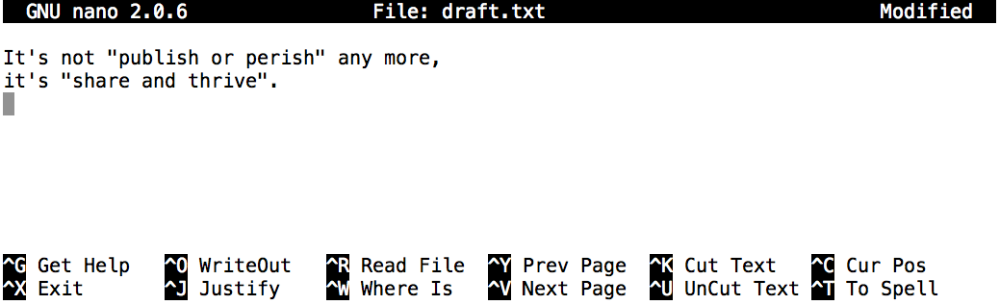

**Unix Shell**
--------------

1. What is Unix and Shell?
==========================

``Unix`` or ``Linux`` is our operating system – the program that controls the processes and their access to the network, screen, etc.

The ``shell`` is a process – it happens to be one that can see its own OS, which is one of the reasons it’s so useful.

The ``Unix shell`` has been around longer than most of its users have been alive. It has survived so long because it's a power tool that allows people to do complex things with just a few keystrokes. More importantly, it helps them combine existing programs in new ways and automate repetitive tasks so that they don't have to type the same things over and over again

The part of the operating system responsible for managing files and directories is called the file system. It organizes our data into files, which hold information, and directories (also called "folders"), which hold files or other directories.

2. Files and Directories
========================

Several commands are frequently used to create, inspect, rename, and delete files and directories. To start exploring them, let's open a shell window:

.. code-block :: bash

	$

The dollar sign is a prompt, which shows us that the shell is waiting for input; your shell may show something more elaborate.

Type the command ``whoami``, then press the Enter key (sometimes marked Return) to send the command to the shell. The command's output is the ID of the current user, i.e., it shows us who the shell thinks we are:

.. code-block :: bash

	$ whoami
	upendra_35

More specifically, when we type ``whoami`` in the shell. It does the following:

- finds a program called ``whoami``,
- runs that program,
- displays that program's output, then
- displays a new prompt to tell us that it's ready for more commands.

Next, let's find out where we are by running a command called ``pwd`` (which stands for "print working directory"). At any moment, our current working directory is our current default directory, i.e., the directory that the computer assumes we want to run commands in unless we explicitly specify something else. 

.. code-block :: bash

	$ pwd
	/Users/upendra_35

Here, the computer's response is ``/Users/upendra_35``, which is my "home directory"

To understand what a "home directory" is, let's have a look at how the file system as a whole is organized. At the top is the ``root`` directory that holds everything else. We refer to it using a slash character ``/`` on its own;

Inside that directory are several other directories: ``bin`` (which is where some built-in programs are stored), ``data`` (for miscellaneous data files), ``Users`` (where users' personal directories are located), ``tmp`` (for temporary files that don't need to be stored long-term), and so on:

|file_system|

2.1 The Filesystem
~~~~~~~~~~~~~~~~~~

We know that our current working directory ``/Users/upendra_35`` is stored inside ``/Users`` because ``/Users`` is the first part of its name. Similarly, we know that ``/Users`` is stored inside the root directory ``/`` because its name begins with ``/``.

.. Note ::

	There are two meanings for the ``/`` character. When it appears at the front of a file or directory name, it refers to the root directory. When it appears inside a name, it's just a separator.

Let's see what's in my home directory by running ``ls``, which stands for "listing":

.. code-block :: bash

	$ ls
	Applications	Documents	Dropbox		Movies		Pictures	PycharmProjects		miniconda3
	Desktop			Downloads	Library		Music		Public		git-prompt.sh		misc

For these lessons, let's download a set of files which emulates the home filesystem of a user named **Nelle** so that each of us are working on the same filesystem. Issue the following commands on your home directory to download and change into Nelle's home directory:

.. code-block :: bash

	$ git clone https://github.com/eharstad/filesystem.git
	$ cd filesystem/users/nelle

Let's see what's in Nelle's home directory by running ``ls``:

.. code-block :: bash

	$ ls
	Desktop			data			north-pacific-gyre	pizza.cfg		writing
	creatures		molecules		notes.txt		solar.pdf

``ls`` prints the names of the files and directories in the current directory in alphabetical order, arranged neatly into columns. We can make its output more comprehensible by using the flag ``-F``, which tells ls to add a trailing ``/`` to the names of directories:

.. code-block :: bash

	$ ls -F
	Desktop/		data/			north-pacific-gyre/	pizza.cfg		writing/	creatures/		molecules/		notes.txt		solar.pdf

Here, we can see that ``/users/nelle`` contains six sub-directories. The names that don't have trailing slashes, like ``notes.txt``, ``pizza.cfg``, and ``solar.pdf``, are plain files. And note that there is a space between ``ls`` and ``-F``: without it, the shell thinks we're trying to run a command called ``ls-F``, which doesn't exist.

|file_system3|

.. Note ::

	You may have noticed that all of Nelle's files' names are "something dot something". This is just a convention: we can call a file mythesis or almost anything else we want. However, most people use two-part names most of the time to help them (and their programs) tell different kinds of files apart. The second part of such a name is called the filename extension, and indicates what type of data the file holds: ``.txt`` signals a plain text file, ``.pdf`` indicates a PDF document, ``.cfg`` is a configuration file full of parameters for some program or other, and so on.

	This is just a convention, albeit an important one. Files contain bytes: it's up to us and our programs to interpret those bytes according to the rules for PDF documents, images, and so on.

	Naming a PNG image of a whale as ``whale.mp3`` doesn't somehow magically turn it into a recording of whalesong, though it might cause the operating system to try to open it with a music player when someone double-clicks it.

Now let's take a look at what's in Nelle's data directory by running ``ls -F data``, i.e., the command ls with the arguments ``-F`` and ``data``. The second argument --- the one without a leading dash --- tells ls that we want a listing of something other than our current working directory:

.. code-block :: bash

	$ ls -F data
	amino-acids.txt		elements/		morse.txt		pdb/			planets.txt		sunspot.txt

The output shows us that there are four text files and two sub-sub-directories. Organizing things hierarchically in this way helps us keep track of our work: it's possible to put hundreds of files in our home directory, just as it's possible to pile hundreds of printed papers on our desk, but it's a self-defeating strategy.

.. Note :: 

	By the way that we spelled the directory name data. It doesn't have a trailing slash: that's added to directory names by ``ls`` when we use the ``-F`` flag to help us tell things apart. And it doesn't begin with a slash because it's a relative path, i.e., it tells ls how to find something from where we are, rather than from the root of the file system.

.. important ::

	**Parameters vs. Arguments**: According to Wikipedia, the terms argument and parameter mean slightly different things. In practice, however, most people use them interchangeably or inconsistently, so we will too.

If we run ``ls -F /data`` (with a leading slash) we get a different answer, because ``/data`` is an absolute path:

.. code-block :: bash

	$ ls -F /data
	access.log	backup/		hardware.cfg	network.cfg

The leading ``/`` tells the computer to follow the path from the root of the filesystem, so it always refers to exactly one directory, no matter where we are when we run the command.

What if we want to change our current working directory? 

We can use ``cd`` followed by a directory name to change our working directory. ``cd`` stands for "change directory", which is a bit misleading: the command doesn't change the directory, it changes the shell's idea of what directory we are in.

.. code-block :: bash

	$ cd data

``cd`` doesn't print anything, but if we run ``pwd`` after it, we can see that we are now in ``/Users/upendra_35/filesystem/users/nelle/data``. If we run ``ls`` without arguments now, it lists the contents of ``/Users/upendra_35/filesystem/users/nelle/data``, because that's where we now are:

.. code-block :: bash

	$ pwd
	/Users/upendra_35/filesystem/users/nelle/data

.. code-block :: bash

	$ ls -F
	amino-acids.txt		elements/		morse.txt		pdb/			planets.txt		sunspot.txt

We now know how to go down the directory tree: how do we go up? We could use two ways..

We could use an absolute path:

.. code-block :: bash

	$ cd /Users/upendra_35/filesystem/users/nelle

or a relative path:

.. code-block :: bash

	$ cd ..

``..`` is a special directory name meaning "the directory containing this one", or more succinctly, the parent of the current directory. Sure enough, if we run ``pwd`` after running ``cd ..``, we're back in ``/Users/upendra_35/filesystem/users/nelle``:

.. code-block :: bash

	$ pwd
	/Users/upendra_35/filesystem/users/nelle

The special directory ``..`` doesn't usually show up when we run ``ls``. If we want to display it, we can give ls the ``-a`` flag:

``-a`` stands for "show all"; it forces ls to show us file and directory names that begin with `.`, such as ``..`` (which, if we're in ``/Users/upendra_35/filesystem/users/nelle``, refers to the ``/Users`` directory). As you can see, it also displays another special directory that's just called ``.``, which means "the current working directory". It may seem redundant to have a name for it, but we'll see some uses for it soon.

.. code-block :: bash

	$ ls -a
	.			.bash_profile		creatures		molecules		notes.txt		solar.pdf
	..			Desktop			data			north-pacific-gyre	pizza.cfg		writing

2.2 Nelle's Pipeline: Organizing Files
~~~~~~~~~~~~~~~~~~~~~~~~~~~~~~~~~~~~~~

Knowing just this much about files and directories, Nelle is ready to organize the files that the protein assay machine will create. First, she creates a directory called ``north-pacific-gyre`` (to remind herself where the data came from). Inside that, she creates a directory called ``2012-07-03``, which is the date she started processing the samples. She used to use names like ``conference-paper`` and ``revised-results``, but she found them hard to understand after a couple of years. (The final straw was when she found herself creating a directory called ``revised-revised-results-3``.)

.. Note ::

	Nelle names her directories "year-month-day", with leading zeroes for months and days, because the shell displays file and directory names in alphabetical order. If she used month names, December would come before July; if she didn't use leading zeroes, November ('11') would come before July ('7').

Each of her physical samples is labelled according to her lab's convention with a unique ten-character ID, such as "NENE01729A". This is what she used in her collection log to record the location, time, depth, and other characteristics of the sample, so she decides to use it as part of each data file's name. Since the assay machine's output is plain text, she will call her files NENE01729A.txt, NENE01812A.txt, and so on. All 1520 files will go into the same directory.

If she is in her home directory, Nelle can see what files she has using the command:

.. code-block :: bash

	$ ls north-pacific-gyre/2012-07-03/

This is a lot to type, but she can let the shell do most of the work. If she types:

.. code-block :: bash

	$ ls nor

and then presses tab, the shell automatically completes the directory name for her:

.. code-block :: bash

	$ ls north-pacific-gyre/

If she presses tab again, Bash will add ``2012-07-03/`` to the command, since it's the only possible completion. Pressing tab again does nothing, since there are 1520 possibilities; pressing tab twice brings up a list of all the files, and so on. This is called ``tab completion``, and we will see it in many other tools as we go on.

- **Exercises**

|file_system2|

1. If ``pwd`` displays ``/users/thing``, what will ``ls ../backup`` display?

a. 	``../backup: No such file or directory``
b. ``2012-12-01 2013-01-08 2013-01-27``
c. ``2012-12-01/ 2013-01-08/ 2013-01-27/``
d. ``original pnas_final pnas_sub``

2. If ``pwd`` displays ``/users/backup``, and ``-r`` tells ls to display things in reverse order, what command will display:

.. code-block :: bash

	pnas-sub/ pnas-final/ original/

a. ``ls pwd``
b. ``ls -r -F``
c. ``ls -r -F /users/backup``
d. Either #2 or #3 above, but not #1

3. What does the command ``cd`` without a directory name do?

a. It has no effect.
b. It changes the working directory to /.
c. It changes the working directory to the user's home directory.
d. It produces an error message.

3. Creating files and folders
=============================

We now know how to explore files and directories, but how do we create them in the first place? 

Let's create a new directory called ``thesis`` using the command ``mkdir thesis`` (which has no output):

.. warning :: 

	Make sure you create this directory in ``nelle`` directory the path of which is ``/Users/upendra_35/filesystem/users/nelle``

.. code-block :: bash

	$ mkdir thesis

As you might (or might not) guess from its name, ``mkdir`` means "make directory". Since ``thesis`` is a relative path (i.e., doesn't have a leading slash), the new directory is created in the current working directory:

.. code-block :: bash

	$ ls -F
	Desktop			data			north-pacific-gyre	pizza.cfg		thesis
	creatures		molecules		notes.txt			solar.pdf		writing

However, there's nothing in it yet:

.. code-block :: bash

	$ ls -F thesis

There are several ways to create a file but one of the simplest ways to create an empty file is via the ``touch`` command. Change the working directory to ``thesis`` using ``cd``, then touch an empty file called ``draft.txt``:

.. code-block :: bash

	$ cd thesis
	$ touch draft.txt

If we check the directory contents now,

.. code-block :: bash

	$ ls 
	draft.txt

Another way to create a file is to run a text editor called ``Nano`` to create a file called ``draft.txt``:

.. code-block :: bash

	$ nano draft.txt

.. Tip ::

	Which Editor?
	When we say, "nano is a text editor," we really do mean "text": it can only work with plain character data, not tables, images, or any other human-friendly media. We use it in examples because almost anyone can drive it anywhere without training, but please use something more powerful for real work. On Unix systems (such as Linux and Mac OS X), many programmers use Emacs or Vim (both of which are completely unintuitive, even by Unix standards), or a graphical editor such as Gedit. On Windows, you may wish to use Notepad++.

	No matter what editor you use, you will need to know where it searches for and saves files. If you start it from the shell, it will (probably) use your current working directory as its default location. If you use your computer's start menu, it may want to save files in your desktop or documents directory instead. You can change this by navigating to another directory the first time you "Save As..."

Let's type in a few lines of text, then use Control-X to write our data to disk and exit it:

|nano_1|

nano doesn't leave any output on the screen after it exits, but ``ls`` now shows that we have created a file called ``draft.txt``:

.. code-block :: bash

	$ ls 
	draft.txt

Let's tidy up by running rm draft.txt:

.. code-block :: bash

	$ rm draft.txt

This command removes files ("rm" is short for "remove"). If we run ``ls`` again, its output is empty once more, which tells us that our file is gone:

.. warning ::

	**Deleting Is Forever**. The Unix shell doesn't have a trash bin that we can recover deleted files from (though most graphical interfaces to Unix do). Instead, when we delete files, they are unhooked from the file system so that their storage space on disk can be recycled. Tools for finding and recovering deleted files do exist, but there's no guarantee they'll work in any particular situation, since the computer may recycle the file's disk space right away.

So in order to avoid this situation make sure you ask Unix to prompt for you. For example

.. code-block :: bash

	$ rm -i draft.txt
	remove draft.txt? 

Now you can enter either ``y`` or ``n``

What if we want to remove the entire ``thesis`` directory?

If we try to remove the entire thesis directory using ``rm thesis``, we get an error message:

.. code-block :: bash

	$ cd ..
	$ rm thesis
	rm: thesis: is a directory

This happens because ``rm`` only works on files, not directories. The right command is ``rmdir``, which is short for "remove directory". It doesn't work yet either, though, because the directory we're trying to remove isn't empty:

.. code-block :: bash
	
	$ rmdir thesis
	rmdir: thesis: Directory not empty

This little safety feature can save you a lot of grief, particularly if you are a bad typist. To really get rid of thesis we must first delete the file ``draft.txt``:

.. code-block :: bash

	$ rm thesis/draft.txt

The directory is now empty, so rmdir can delete it:

.. code-block :: bash

	$ rmdir thesis

However this is tedious. Imagine you have several files in that directories. Instead we can use ``rm`` with the ``-r`` flag (which stands for "recursive")

.. code-block :: bash

	$ rm -r thesis

.. warning ::

	This removes everything in the directory, then the directory itself. If the directory contains sub-directories, ``rm -r`` does the same thing to them, and so on. It's very handy, but can do a lot of damage if used without care.

Let's create that directory and file one more time. 

.. Note :: 

	This time we're running nano with the path ``thesis/draft.txt``, rather than going into the thesis directory and running nano on draft.txt there.

.. code-block :: bash

	$ mkdir thesis
	$ nano thesis/draft.txt
	$ ls thesis
	draft.txt

``draft.txt`` isn't a particularly informative name, so let's change the file's name using ``mv``, which is short for "move":

.. code-block :: bash
	
	$ mv thesis/draft.txt thesis/quotes.txt

The first parameter tells ``mv`` what we're "moving", while the second is where it's to go. In this case, we're moving ``thesis/draft.txt`` to ``thesis/quotes.txt``, which has the same effect as renaming the file. Sure enough, ``ls`` shows us that thesis now contains one file called ``quotes.txt``

Just for the sake of inconsistency, ``mv`` also works on directories --- there is no separate ``mvdir`` command.

Let's move ``quotes.txt`` into the current working directory. We use ``mv`` once again, but this time we'll just use the name of a directory as the second parameter to tell mv that we want to keep the filename, but put the file somewhere new. (This is why the command is called "move".) In this case, the directory name we use is the special directory name ``.`` that we mentioned earlier.

.. code-block :: bash

	$ mv thesis/quotes.txt .

The effect is to move the file from the directory it was in to the current working directory. ``ls`` now shows us that thesis is empty:

.. code-block :: bash

	$ ls thesis

The ``cp`` command works very much like ``mv``, except it copies a file instead of moving it. We can check that it did the right thing using ``ls`` with two paths as parameters --- like most Unix commands, ``ls`` can be given thousands of paths at once:

.. code-block :: bash

	$ cp quotes.txt thesis/quotations.txt
	$ ls quotes.txt thesis/quotations.txt
	quotes.txt   thesis/quotations.txt

To prove that we made a copy, let's delete the ``quotes.txt`` file in the current directory and then run that same ``ls`` again.

.. code-block :: bash

	$ rm quotes.txt
	$ ls quotes.txt thesis/quotations.txt
	ls: cannot access quotes.txt: No such file or directory
	thesis/quotations.txt

This time it tells us that it can't find ``quotes.txt`` in the current directory, but it does find the copy in thesis that we didn't delete.

- Exercise

1. Suppose that you created a ``.txt`` file in your current directory to contain a list of the statistical tests you will need to do to analyze your data, and named it: ``statstics.txt``

After creating and saving this file you realize you misspelled the filename! You want to correct the mistake, which of the following commands could you use to do so?

1. ``cp statstics.txt statistics.txt``
2. ``mv statstics.txt statistics.txt``
3. ``mv statstics.txt .``
4. ``cp statstics.txt .``

2. What is the output of the closing ls command in the sequence shown below?

.. code-block :: bash

	$ pwd
	/home/jamie/data
	$ ls
	proteins.dat
	$ mkdir recombine
	$ mv proteins.dat recombine
	$ cp recombine/proteins.dat ../proteins-saved.dat
	$ ls

1. ``proteins-saved.dat recombine``
2. ``recombine``
3. ``proteins.dat recombine``
4. ``proteins-saved.dat``

4. Pipes and Filters
====================

Now that we know a few basic commands, we can finally look at the shell's most powerful feature: the ease with which it lets us combine existing programs in new ways. We'll start with a directory called ``molecules`` that contains six files describing some simple organic molecules. The ``.pdb`` extension indicates that these files are in Protein Data Bank format, a simple text format that specifies the type and position of each atom in the molecule.

.. code-block :: bash

	$ ls molecules
	cubane.pdb	ethane.pdb	methane.pdb	octane.pdb	pentane.pdb	propane.pdb

Let's ``cd`` into that directory and run the command ``wc *.pdb``. ``wc`` is the "word count" command: it counts the number of lines, words, and characters in files. The ``*`` in ``*.pdb`` matches zero or more characters, so the shell turns ``*.pdb`` into a complete list of .pdb files:

.. code-block :: bash

	$ wc *.pdb
      20     156    1158 cubane.pdb
      12      84     622 ethane.pdb
       9      57     422 methane.pdb
      30     246    1828 octane.pdb
      21     165    1226 pentane.pdb
      15     111     825 propane.pdb
     107     819    6081 total

.. important ::

	Wildcards:

	``*`` is a wildcard. It matches zero or more characters, so ``*.pdb`` matches ethane.pdb, propane.pdb, and so on. On the other hand, ``p*.pdb`` only matches pentane.pdb and ``propane.pdb``, because the 'p' at the front only matches itself.

	``?`` is also a wildcard, but it only matches a single character. This means that ``p?.pdb`` matches ``pi.pdb`` or ``p5.pdb``, but not ``propane.pdb``. We can use any number of wildcards at a time: for example, ``p*.p?*`` matches anything that starts with a ``p`` and ends with ``.``, ``p``, and at least one more character (since the ``?`` has to match one character, and the final ``*`` can match any number of characters). Thus, ``p*.p?*`` would match preferred.practice, and even ``p.pi`` (since the first ``*`` can match no characters at all), but not quality.practice (doesn't start with ``p``) or preferred.p (there isn't at least one character after the ``.p``).

	When the shell sees a wildcard, it expands the wildcard to create a list of matching filenames before running the command that was asked for. As an exception, if a wildcard expression does not match any file, Bash will pass the expression as a parameter to the command as it is. For example typing ``ls *.pdf`` in the molecules directory (which contains only files with names ending with .pdb) results in an error message that there is no file called *.pdf. However, generally commands like wc and ls see the lists of file names matching these expressions, but not the wildcards themselves. It is the shell, not the other programs, that deals with expanding wildcards, and this another example of orthogonal design.

If we run wc -l instead of just wc, the output shows only the number of lines per file:

.. code-block :: bash

	$ wc -l *.pdb
      20 cubane.pdb
      12 ethane.pdb
       9 methane.pdb
      30 octane.pdb
      21 pentane.pdb
      15 propane.pdb
     107 total

Similarly we can also use ``-w`` to get only the number of words, or ``-c`` to get only the number of characters.

Which of these files is shortest? It's an easy question to answer when there are only six files, but what if there were 6000? Our first step toward a solution is to run the command:

.. code-block :: bash

	$ wc -l *.pdb > lengths.txt

The greater than symbol, ``>``, tells the shell to redirect the command's output to a file instead of printing it to the screen. The shell will create the file if it doesn't exist, or overwrite the contents of that file if it does. (This is why there is no screen output: everything that wc would have printed has gone into the file ``lengths.txt`` instead.)

We can now send the content of lengths.txt to the screen using ``cat lengths.txt``. cat stands for "concatenate": it prints the contents of files one after another. There's only one file in this case, so ``cat`` just shows us what it contains:

.. code-block :: bash

	$ cat lengths.txt
	20  cubane.pdb
	12  ethane.pdb
	9  methane.pdb
	30  octane.pdb
	21  pentane.pdb
	15  propane.pdb
	107  total

Now let's use the ``sort`` command to sort its contents. We will also use the ``-n`` flag to specify that the sort is numerical instead of alphabetical. This does not change the file; instead, it sends the sorted result to the screen:

.. code-block :: bash

	$ sort -n lengths.txt
	9  methane.pdb
	12  ethane.pdb
	15  propane.pdb
	20  cubane.pdb
	21  pentane.pdb
	30  octane.pdb
	107  total

Now if you run ``sort -n lengths.txt | head -1`` it will tell you the first line of the file. Using the parameter ``-1`` with ``head`` tells it that we only want the first line of the file. The vertical bar between the two commands is called a **pipe**. It tells the shell that we want to use the output of the command on the left as the input to the command on the right. The computer might create a temporary file if it needs to, or copy data from one program to the other in memory, or something else entirely; we don't have to know or care.

.. code-block :: bash

	$ sort -n lengths.txt | head -1
	9  methane.pdb

Instead of creating an intermediate file ``lengths.txt`` we can use another pipe to send the output of ``wc`` directly to ``sort``, which then sends its output to head:

.. code-block :: bash

	$ wc -l *.pdb | sort -n | head -1
	9  methane.pdb

- Exercises

1. What does ``sort -n`` do?

If we run sort on this file:

.. code-block :: bash

	10
	2
	19
	22
	6

the output is:

.. code-block :: bash

	10
	19
	2
	22
	6

If we run ``sort -n`` on the same input, we get this instead:

.. code-block :: bash

	2
	6
	10
	19
	22

2. Explain why ``-n`` has this effect.

In our current directory, we want to find the 3 files which have the least number of lines. Which command listed below would work?

1. ``wc -l * > sort -n > head -3``
2. ``wc -l * | sort -n | head 1-3``
3. ``wc -l * | head -3 | sort -n``
4. ``wc -l * | sort -n | head -3``

3. What does ``>>`` mean?

What is the difference between:

``echo hello > testfile01.txt``

and:

``echo hello >> testfile02.txt``

Hint: Try executing each command twice in a row and then examining the output files.

4. The command ``uniq`` removes adjacent duplicated lines from its input. For example, if a file ``salmon.txt`` contains:

.. code-block :: bash

	coho
	coho
	steelhead
	coho
	steelhead
	steelhead

then ``uniq salmon.txt`` produces:

.. code-block :: bash

	coho
	steelhead
	coho
	steelhead

Why do you think ``uniq`` only removes *adjacent* duplicated lines? (Hint: think about very large data sets.) What other command could you combine with it in a pipe to remove all duplicated lines?

5. Finding things
=================

You can guess someone's age by how they talk about search: young people use "Google" as a verb, while crusty old Unix programmers use ``grep``. The word is a contraction of "global/regular expression/print", a common sequence of operations in early Unix text editors. It is also the name of a very useful command-line program.

``grep`` finds and prints lines in files that match a pattern. For our examples, we will use a file that contains three haikus taken from a 1998 competition in Salon magazine. For this set of examples we're going to be working in the writing subdirectory:

.. code-block :: bash

	$ cd
	$ cd writing
	$ cat haiku.txt
	The Tao that is seen
	Is not the true Tao, until
	You bring fresh toner.

	With searching comes loss
	and the presence of absence:
	"My Thesis" not found.

	Yesterday it worked
	Today it is not working
	Software is like that.

Let's find lines that contain the word "not":

.. code-block :: bash

	$ grep not haiku.txt
	Is not the true Tao, until
	"My Thesis" not found
	Today it is not working

Here, ``not`` is the pattern we're searching for. It's pretty simple: every alphanumeric character matches against itself. After the pattern comes the name or names of the files we're searching in. The output is the three lines in the file that contain the letters "not".

Let's try a different pattern: "day".

.. code-block :: bash

	$ grep day haiku.txt
	Yesterday it worked
	Today it is not working

This time, two lines that include the letters "day" are outputted. However, these letters are contained within larger words. To restrict matches to lines containing the word "day" on its own, we can give ``grep`` with the ``-w`` flag. This will limit matches to word boundaries.

.. code-block :: bash

	$ grep -w day haiku.txt

In this case, there aren't any, so grep's output is empty.

Another useful option is ``-n``, which numbers the lines that match:

.. code-block :: bash

	$ grep -n it haiku.txt
	5:With searching comes loss
	9:Yesterday it worked
	10:Today it is not working

Here, we can see that lines 5, 9, and 10 contain the letters "it".

We can combine flags as we do with other Unix commands. For example, since ``-i`` makes matching case-insensitive and ``-v`` inverts the match, using them both only prints lines that don't match the pattern in any mix of upper and lower case:

.. code-block :: bash

	$ grep -i -v the haiku.txt
	You bring fresh toner.

	With searching comes loss

	Yesterday it worked
	Today it is not working
	Software is like that.

``grep`` has lots of other options. To find out what they are, we can type ``man grep``. ``man`` is the Unix "manual" command: it prints a description of a command and its options, and (if you're lucky) provides a few examples of how to use it.

``grep's`` real power doesn't come from its options, though; it comes from the fact that patterns can include wildcards. (The technical name for these is regular expressions, which is what the "re" in "grep" stands for.) Regular expressions are both complex and powerful; if you want to do complex searches. For example, we can find lines that have an 'o' in the second position like this:

.. code-block :: bash

	$ grep '^.o' haiku.txt
	You bring fresh toner.
	Today it is not working
	Software is like that.

The ``^`` in the pattern anchors the match to the start of the line. The ``.`` matches a single character (just like ``?`` in the shell), while the ``o`` matches an actual ``o`` letter.

While ``grep`` finds lines in files, the ``find`` command finds files themselves. Again, it has a lot of options; to show how the simplest ones work, we'll use the directory tree shown below.

- Exercise

1. From the ``haiku.txt`` file, which command would result in the following output: ``and the presence of absence``

1. ``grep of haiku.txt``
2. ``grep -E of haiku.txt``
3. ``grep -w of haiku.txt``
4. ``grep -i of haiku.txt``

6. Loops
========

Wildcards and tab completion are two ways to reduce typing (and typing mistakes). Another is to tell the shell to do something over and over again. Suppose we have several hundred genome data files named ``basilisk.dat``, ``unicorn.dat``, and so on. In this example, we'll use the creatures directory which only has two example files, but the principles can be applied to many many more files at once. We would like to modify these files, but also save a version of the original files and rename them as ``original-basilisk.dat`` and ``original-unicorn.dat``. We can't use:

.. code-block :: bash

	$ cd ../creatures	
	$ mv *.dat original-*.dat

because that would expand to:

.. code-block :: bash

	$ mv basilisk.dat unicorn.dat original-*.dat

This a problem arises when ``mv`` receives more than two inputs. When this happens, it expects the last input to be a directory where it can move all the files it was passed to. Since there is no directory named ``original-*.dat`` in the creatures directory we get an error.

Instead, we can use a loop to do some operation once for each thing in a list. Here's a simple example that displays the first three lines of each file in turn:

.. code-block :: bash

	$ for filename in basilisk.dat unicorn.dat
	  do 
	  	head -3 $filename
	  done

When the shell sees the keyword ``for``, it knows it is supposed to repeat a command (or group of commands) once for each thing in a list. In this case, the list is the two filenames. Each time through the loop, the name of the thing currently being operated on is assigned to the variable called ``filename``. Inside the loop, we get the variable's value by putting ``$`` in front of it: ``$filename`` is ``basilisk.dat`` the first time through the loop, ``unicorn.dat`` the second, and so on.

By using the dollar sign we are telling the shell interpreter to treat ``filename`` as a variable name and substitute its value on its place, but not as some text or external command. When using variables it is also possible to put the names into curly braces to clearly delimit the variable name: ``$filename`` is equivalent to ``${filename}``, but is different from ``${file}name``. You may find this notation in other people's programs.

Finally, the command that's actually being run is our old friend head, so this loop prints out the first three lines of each data file in turn.

Here's a slightly more complicated loop:

.. code-block :: bash

	$ for filename in *.dat
	  do
		echo $filename
		head -n 10 $filename | tail -n 3
	  done

Going back to our original file renaming problem, we can solve it using this loop:

.. code-block :: bash

	$ for filename in *.dat
	  do
	  	echo $filename
	  	mv $filename original-$filename
	  done
	basilisk.dat
	unicorn.da

This loop runs the ``mv`` command once for each filename. The first time, when ``$filename`` expands to basilisk.dat, the shell executes:

.. code-block :: bash

	mv basilisk.dat original-basilisk.dat

The second time, the command is:

.. code-block :: bash

	mv unicorn.dat original-unicorn.dat

- Exercises

1. Suppose that ``ls`` initially displays:

.. code-block :: bash

	fructose.dat    glucose.dat   sucrose.dat

What is the output of:

.. code-block :: bash

	for datafile in *.dat
	do
	    ls *.dat
	done

Now, what is the output of:

.. code-block :: bash

	for datafile in *.dat
	do
	  ls $datafile
	done

Why do these two loops give you different outputs?

7. Scripting in Shell
=====================

We are finally ready to see what makes the shell such a powerful programming environment. We are going to take the commands we repeat frequently and save them in files so that we can re-run all those operations again later by typing a single command. For historical reasons, a bunch of commands saved in a file is usually called a shell script, but make no mistake: these are actually small programs.

Let's start by going back to ``molecules/`` direcotry and create a file called ``middle.sh`` with the following content ``head -15 octane.pdb | tail -5``. It selects lines 11-15 of the file ``octane.pdb``

.. code-block :: bash

	$ nano middle.sh

Once we have saved the file, we can ask the shell to execute the commands it contains. Our shell is called ``bash``, so we run the following command:

.. code-block :: bash

	$ bash middle.sh 
	ATOM      9  H           1      -4.502   0.681   0.785  1.00  0.00
	ATOM     10  H           1      -5.254  -0.243  -0.537  1.00  0.00
	ATOM     11  H           1      -4.357   1.252  -0.895  1.00  0.00
	ATOM     12  H           1      -3.009  -0.741  -1.467  1.00  0.00
	ATOM     13  H           1      -3.172  -1.337   0.206  1.00  0.00

Sure enough, our script's output is exactly what we would get if we ran that pipeline directly.

What if we want to select lines from an arbitrary file? We could edit ``middle.sh`` each time to change the filename, but that would probably take longer than just retyping the command. Instead, let's edit ``middle.sh`` and replace ``octane.pdb`` with a special variable called ``$1``:

.. code-block :: bash

	head -15 $1 | tail -5

Inside a shell script, ``$1`` means "the first filename (or other parameter) on the command line". We can now run our script like this:

.. code-block :: bash

	$ bash middle.sh octane.pdb

We can still edit ``middle.sh`` to adjust the range of lines, though. Let's fix that by using the special variables ``$2`` and ``$3``:

.. code-block :: bash

	head "$2" "$1" | tail "$3"

and run it like this

.. code-block :: bash

	bash middle.sh pentane.pdb -20 -5

This works, but it may take the next person who reads ``middle.sh`` a moment to figure out what it does. We can improve our script by adding some comments at the top:

.. code-block :: bash

	# Select lines from the middle of a file.
	# Usage: middle.sh filename -end_line -num_lines
	head "$2" "$1" | tail "$3"

.. Note ::

	A comment starts with a ``#`` character and runs to the end of the line. The computer ignores comments, but they're invaluable for helping people understand and use scripts.

What if we want to process many files in a single pipeline? For example, if we want to sort our ``.pdb`` files by length, we would type:

.. code-block :: bash

	$ wc -l *.pdb | sort -n

because ``wc -l`` lists the number of lines in the files (recall that wc stands for 'word count', adding the -l flag means 'count lines' instead) and ``sort -n`` sorts things numerically. We could put this in a file, but then it would only ever sort a list of ``.pdb`` files in the current directory. If we want to be able to get a sorted list of other kinds of files, we need a way to get all those names into the script. We can't use ``$1``, ``$2``, and so on because we don't know how many files there are. Instead, we use the special variable ``$@``, which means, "All of the command-line parameters to the shell script." We also should put ``$@`` inside double-quotes to handle the case of parameters containing spaces ("$@" is equivalent to "$1" "$2" ...) Here's an example:

.. code-block :: bash

	$ nano sorted.sh
	wc -l "$@" | sort -n

.. code-block :: bash

	$ bash sorted.sh *.pdb ../creatures/*.dat
       9 methane.pdb
      12 ethane.pdb
      15 propane.pdb
      20 cubane.pdb
      21 pentane.pdb
      30 octane.pdb
     163 ../creatures/original-basilisk.dat
     163 ../creatures/original-unicorn.dat
     433 total

.. tip ::

	In practice, most people develop shell scripts by running commands at the shell prompt a few times to make sure they're doing the right thing, then saving them in a file for re-use. This style of work allows people to recycle what they discover about their data and their workflow with one call to history and a bit of editing to clean up the output and save it as a shell script.

- Exercises

1. In the ``molecules`` directory, you have a shell script called ``script.sh`` containing the following commands:

.. code-block :: bash

	head $2 $1
	tail $3 $1

While you are in the molecules directory, you type the following command:

``bash script.sh "*.pdb" -1 -1``

Which of the following outputs would you expect to see?

1. ``All of the lines between the first and the last lines of each file ending in *.pdb in the molecules directory``
2. ``The first and the last line of each file ending in *.pdb in the molecules directory``
3. ``The first and the last line of each file in the molecules directory``
4. ``An error because of the quotes around *.pdb``

2. Leah has several hundred data files, each of which is formatted like this:

.. code-block :: bash

	2013-11-05,deer,5
	2013-11-05,rabbit,22
	2013-11-05,raccoon,7
	2013-11-06,rabbit,19
	2013-11-06,deer,2
	2013-11-06,fox,1
	2013-11-07,rabbit,18
	2013-11-07,bear,1

Write a shell script called ``species.sh`` that takes any number of filenames as command-line parameters, and uses ``cut``, ``sort``, and ``uniq`` to print a list of the unique species appearing in each of those files separately.

3. Write a shell script called ``longest.sh`` that takes the name of a directory and a filename extension as its parameters, and prints out the name of the file with the most lines in that directory with that extension. For example:

.. code-block :: bash

	$ bash longest.sh /tmp/data pdb

would print the name of the ``.pdb`` file in ``/tmp/data`` that has the most lines.

